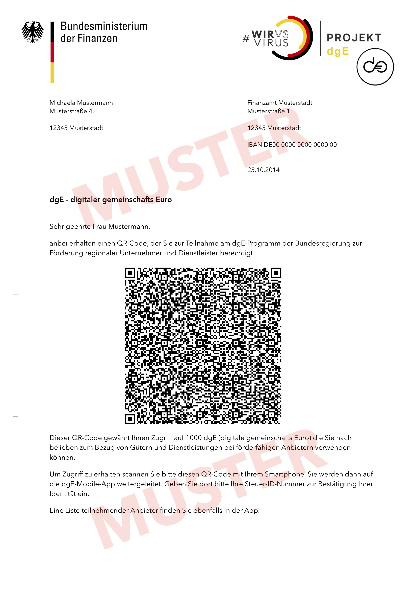
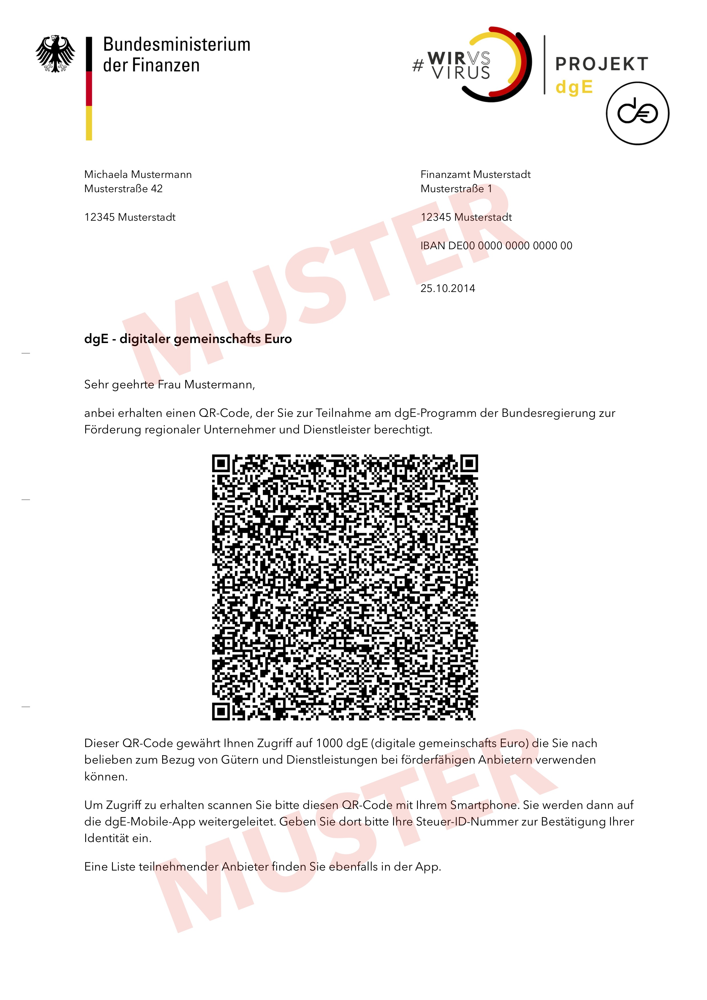

# dgE Krisengeld Howto

Um die dgE Krisengeld App selbst auszuprobieren können Sie einen der folgenden 
10 Beispiel-QR-Codes verwenden.

Scannen Sie einen der QR-Codes einfach mit Ihrem Smartphone und öffnen Sie den hinterlegten Link.

Alle Beispiel-Schreiben verwenden die Steuer-ID '36574261809' als Passwort.

Weitere Details werden in den nächsten Tagen hier hinzugefügt.

